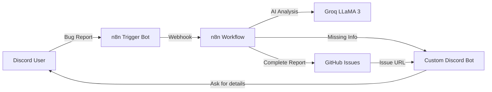

# 🤖 Ops Intake Copilot

[](https://n8n.io)
[](https://groq.com)
[](https://discord.com)
[](https://github.com/features/issues)
[](LICENSE)
[](#-cost-breakdown)

> **Zero-cost automated bug intake from Discord to GitHub Issues using Groq AI.**

Ops Intake Copilot captures bug reports from Discord, uses Groq LLaMA 3 to structure and validate details, and creates clean GitHub Issues automatically. It can also detect incomplete reports or non-bug messages and respond accordingly.

---

## ✨ Features

| Feature | What It Does | Why It Matters |
| --- | --- | --- |
| 🤖 AI extraction | Uses Groq LLaMA 3 to parse free-form messages into structured bug data | Removes manual triage overhead |
| 📥 Discord-first intake | Lets users submit bugs where they already chat | Faster reporting, less context switching |
| 🧠 Smart classification | Detects complete report, incomplete report, or question/chat | Prevents noisy issue creation |
| 🐙 GitHub Issue creation | Auto-creates standardized GitHub Issues with metadata | Improves engineering workflow quality |
| 🔁 Follow-up prompts | Requests missing details in Discord when data is incomplete | Improves bug completeness before filing |
| 💸 Zero-cost stack | Built with free tiers/self-hosted tools | Sustainable for indie teams and OSS |

---

## 🔄 How It Works

1. A user posts a bug report in a Discord channel.
2. The **n8n Trigger Bot** captures the message and sends it into the workflow.
3. n8n calls **Groq LLaMA 3** to extract fields (title, device, browser, severity, repro steps, etc.).
4. The workflow classifies the message:
   - ✅ Complete bug report → create GitHub Issue.
   - ⚠️ Incomplete bug report → ask follow-up in Discord.
   - 💬 Question/greeting → send a helpful response, no issue created.
5. A response message is posted back to Discord with either:
   - the created GitHub Issue link, or
   - a request for missing information.



---

## 🛠️ Tech Stack

| Layer | Tool | Usage | Cost |
| --- | --- | --- | --- |
| Workflow automation | n8n (self-hosted) | Message orchestration + branching logic | $0 |
| AI extraction | Groq (LLaMA 3) | NLP parsing + bug data extraction | $0 (free tier) |
| Chat intake | Discord Bots | User submission + bot replies | $0 |
| Issue tracking | GitHub Issues | Canonical bug backlog | $0 |
| Public webhook access | Cloudflare Tunnel | Secure ingress to self-hosted n8n | $0 |

---

## 🚀 Quick Start

### 1) Clone the repository

```bash
git clone https://github.com/your-username/ops-intake-copilot.git
cd ops-intake-copilot
```

### 2) Prepare required credentials

Create and store these values securely:

```bash
# Required secrets
GITHUB_TOKEN=ghp_xxxxxxxxxxxxxxxxx
GROQ_API_KEY=gsk_xxxxxxxxxxxxxxxxx
DISCORD_BOT_TOKEN=xxxxxxxxxxxxxxxxx
```

### 3) Expose your local n8n instance

```bash
# Example: Cloudflare Tunnel
cloudflared tunnel --url http://localhost:5678
```

### 4) Import and configure the workflow in n8n

```bash
# In n8n UI:
# Workflows -> Import from File -> select your workflow JSON
# Then map credentials for GitHub, Groq, and Discord
```

### 5) Send a test report in Discord

```text
App crashes when uploading profile photo on iPhone 14 Pro using Safari.
Steps: Open app -> Profile -> Upload -> Select image.
Expected: photo uploads.
Actual: app closes immediately.
Severity: High.
```

If configured correctly, Ops Intake Copilot will create a GitHub Issue and respond with the issue link in Discord.

---

## 💰 Cost Breakdown

| Service | Plan | Typical Usage in This Project | Monthly Cost |
| --- | --- | --- | --- |
| n8n | Self-hosted | Unlimited local workflow runs | $0 |
| Groq | Free tier | LLaMA 3 API calls for parsing | $0 |
| Discord | Free | Bot messaging + channel events | $0 |
| GitHub | Free | Issue management | $0 |
| Cloudflare Tunnel | Free | Public endpoint to local n8n | $0 |
| **Total** |  |  | **$0** |

---

## 🧪 Examples

### 1) Complete report (creates issue)

**Input**

```text
The dashboard crashes when I click Export CSV.
Device: MacBook Pro M1
Browser: Chrome 126
Steps: Open dashboard -> click Export CSV
Expected: file downloads
Actual: blank page with 500 error
Severity: High
```

**Behavior**

- Classified as `complete_bug_report`
- GitHub Issue created
- Discord reply includes issue URL

### 2) Incomplete report (asks follow-up)

**Input**

```text
Login is broken.
```

**Behavior**

- Classified as `incomplete_bug_report`
- Bot asks for missing details (device, browser, steps, expected vs actual)
- No issue created yet

### 3) Question / general message (no issue)

**Input**

```text
Hey bot, what kind of reports can I send here?
```

**Behavior**

- Classified as `question_or_chat`
- Bot responds with guidance/examples
- No issue created

---

## 📚 Documentation

- [Setup Guide](docs/SETUP.md) — full installation and credential configuration
- [Troubleshooting](docs/TROUBLESHOOTING.md) — common problems and fixes
- [Test Messages](examples/test-messages.txt) — ready-to-send message scenarios
- [Sample Issue](examples/sample-issue.md) — example GitHub issue output

---

## 📄 License

This project is licensed under the [MIT License](LICENSE).

---

<p align="center">
  Built with 🚀 using n8n + Groq + Discord + GitHub<br />
  If this helped you, consider giving the repo a ⭐
</p>
